<div align="center">

# 🍽️ RePlate

**Turning surplus food into everyday hope.**

RePlate connects restaurants, stores, and home cooks with neighbors and shelters nearby — so good food gets eaten, not wasted.

[](#)
[](#)
[](#)
[](#)
[](#)
[](#)

</div>

---

## 📚 Table of Contents

- [Overview](#-overview)
- [Features](#-features)
- [Screenshots — Light / Dark](#-screenshots)
- [Architecture](#-architecture)
- [Tech Stack](#-tech-stack)
- [Project Structure](#-project-structure)
- [Getting Started](#-getting-started)
- [Testing](#-testing)
- [Roadmap](#-roadmap)
- [Contributing](#-contributing)
- [License](#-license)

---

## 🌱 Overview

RePlate is a full-stack food-donation platform. Donors (individuals, restaurants, wholesalers) list surplus food; receivers (individuals, organizations, shelters) browse and reserve it nearby — reducing waste and fighting hunger in the same motion.

This repo contains **both halves of the stack**:

| Layer | Location | Status |
|---|---|---|
| 🎨 Frontend (React + Vite) | `/src` | ✅ Complete |
| ⚙️ Backend (FastAPI) | `/backend` | 🚧 In progress (incremental steps) |

---

## ✨ Features

<table>
<tr>
<td width="50%" valign="top">

**For Donors**
- 📦 List surplus food in seconds
- 🕒 Set pickup windows before food spoils
- 🏷️ Individual, organization & wholesaler modes
- 📊 Dashboard with donation history & impact stats

</td>
<td width="50%" valign="top">

**For Receivers**
- 🔎 Find food near you
- ✅ Reserve & confirm pickups
- 📜 Full request history
- 🔔 Status tracking end-to-end

</td>
</tr>
</table>

---

## 📸 Screenshots

RePlate ships with a warm, food-first design system — orange for energy & urgency, warm stone neutrals instead of cold gray, and full light/dark support.

<div align="center">

<picture>
  <source media="(prefers-color-scheme: dark)" srcset="docs/screenshots/landing-dark.png">
  <source media="(prefers-color-scheme: light)" srcset="docs/screenshots/landing-light.png">
  
</picture>

<sub>👆 GitHub auto-swaps this image based on your OS light/dark setting</sub>

</div>

<br>

<details>
<summary><b>☀️ Light Mode</b> (click to expand)</summary>
<br>

</details>

<details>
<summary><b>🌙 Dark Mode</b> (click to expand)</summary>
<br>

</details>

<details>
<summary><b>🎨 Design System / Style Guide</b> (click to expand)</summary>
<br>

</details>

---

## 🏗️ Architecture

```mermaid
flowchart LR
    A[💻 Frontend<br/>React + Vite] -->|HTTP / JSON| B[🌐 API Layer<br/>FastAPI]
    B --> C[🧭 Router]
    C --> D[🧠 Service Layer]
    D --> E[🗄️ Repository Layer]
    E --> F[🔗 SQLAlchemy ORM]
    F --> G[(🐘 PostgreSQL)]

    style A fill:#fff7ed,stroke:#ea580c,stroke-width:2px,color:#292524
    style B fill:#ffedd5,stroke:#ea580c,stroke-width:2px,color:#292524
    style C fill:#ffedd5,stroke:#ea580c,stroke-width:2px,color:#292524
    style D fill:#fed7aa,stroke:#c2410c,stroke-width:2px,color:#292524
    style E fill:#fed7aa,stroke:#c2410c,stroke-width:2px,color:#292524
    style F fill:#fdba74,stroke:#9a3412,stroke-width:2px,color:#292524
    style G fill:#ea580c,stroke:#9a3412,stroke-width:2px,color:#fff
```



Authentication (JWT) and the food-request flow plug into this same pipeline in later steps — every request still flows **Router → Service → Repository → SQLAlchemy → Postgres**, keeping business logic out of the routes and SQL out of the services.

---

## 🧰 Tech Stack

| | |
|---|---|
| **Frontend** | React, Vite, TypeScript, Tailwind, Radix UI / shadcn, MUI |
| **Backend** | FastAPI, Uvicorn |
| **Database** | PostgreSQL, SQLAlchemy, Alembic |
| **Auth** | JWT |
| **Tooling** | `uv` (Python), `npm`/`pnpm` (JS), Pytest |

---

## 📁 Project Structure

<details>
<summary>Click to expand full tree</summary>

```text
replate/
├── src/                        # Frontend (React + Vite)
│   ├── app/
│   │   ├── App.tsx
│   │   └── components/         # Pages, dashboards, ui/ primitives
│   └── styles/                 # Theme tokens, fonts, tailwind
│
├── backend/                    # Backend (FastAPI)
│   ├── app/
│   │   ├── main.py             # App entrypoint + CORS
│   │   ├── api/                # Routers (e.g. health)
│   │   ├── core/               # Config / settings
│   │   ├── db/                 # DB session (upcoming)
│   │   ├── models/              # SQLAlchemy models (upcoming)
│   │   ├── schemas/             # Pydantic schemas (upcoming)
│   │   ├── services/            # Business logic (upcoming)
│   │   └── repositories/        # Data access layer (upcoming)
│   ├── tests/
│   ├── .env.example
│   └── pyproject.toml
│
├── docs/screenshots/            # README visuals
└── README.md
```

</details>

---

## 🚀 Getting Started

### Frontend

```bash
npm install
npm run dev
```

### Backend

```bash
cd backend
uv sync                 # install dependencies
cp .env.example .env    # fill in local config
uv run uvicorn app.main:app --reload
```

Then visit:

| Endpoint | URL |
|---|---|
| Health check | `http://localhost:8000/health` |
| Swagger docs | `http://localhost:8000/docs` |
| OpenAPI schema | `http://localhost:8000/openapi.json` |

---

## 🧪 Testing

```bash
cd backend
uv run pytest -q
```

---

## 🗺️ Roadmap

- [x] **Step 1** — FastAPI project setup, `/health`, CORS, `uv` tooling
- [ ] **Step 2** — PostgreSQL + SQLAlchemy + Alembic migrations
- [ ] **Step 3** — User model, signup/login, password hashing
- [ ] **Step 4** — JWT authentication
- [ ] **Step 5** — Food listing & request models/APIs
- [ ] **Step 6** — QR-code pickup confirmation
- [ ] **Step 7** — Notifications
- [ ] **Step 8** — Frontend ↔ backend integration

---

## 📄 License

MIT — see [`LICENSE`](LICENSE) for details.

<div align="center">
<sub>Made with 🧡 for people, not landfills.</sub>
</div>
